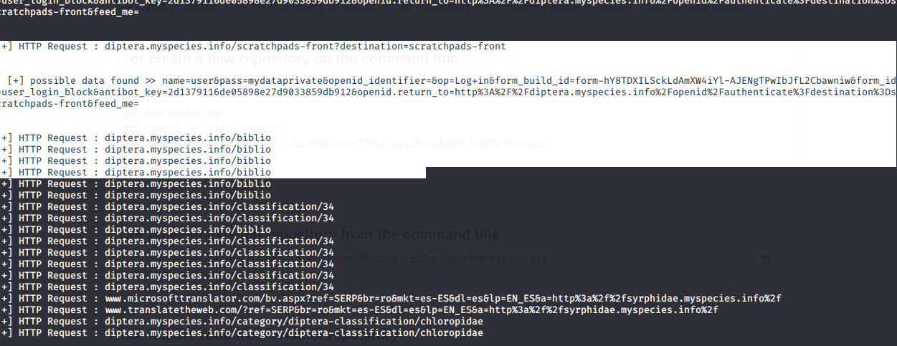

##  evilSimpleSnifferPython

simple Sniffer over interface using all protocols but filter and print over HTTP packets and alert for user and  credentials

python sniffer_data.py

Default interface eth0.

## verify output execution

